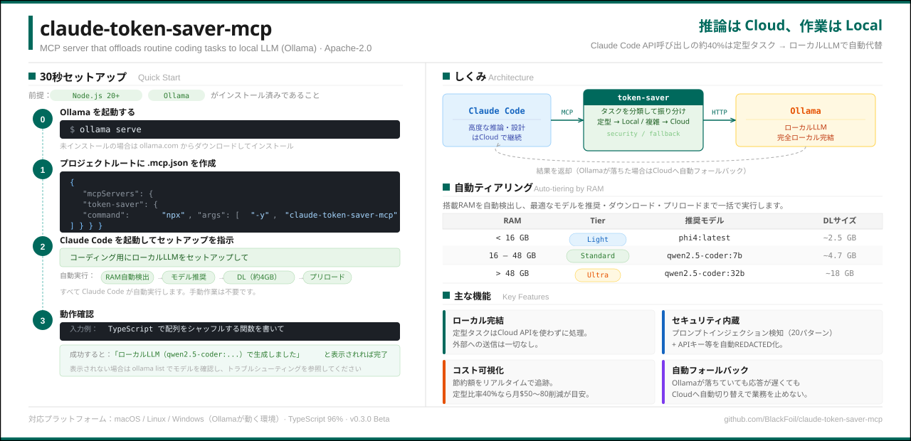

[English](./README.en.md) | 日本語

[](https://github.com/BlackFoil/claude-token-saver-mcp/actions) [](https://www.npmjs.com/package/claude-token-saver-mcp) [](https://github.com/BlackFoil/claude-token-saver-mcp/actions) [](./LICENSE)

# claude-token-saver-mcp

<p align="center">
  
</p>

> **Beta** — 個人利用向け。736 テスト / カバレッジ 97%。

**Claude Code の「それ、ローカルでよくない？」を自動化する MCP サーバー。**

ボイラープレート生成、テスト作成、テキスト要約 — Cloud API に投げるまでもない定型タスクを、手元の [Ollama](https://ollama.com/) でさばきます。セキュリティ対策込み。

<!-- デモGIF: 以下の内容で録画してここに貼ってください -->
<!-- Claude Code で「ソート関数を書いて」→ offload_work 実行 → コード生成 → cost_dashboard で節約額表示 -->
<!-- 推奨: 800x450px, 15-20秒, asciinema or vhs -->

## モチベーション

Claude Code の API 利用を分析してみたら、**リクエストの約 40% は定型的なコード生成やテキスト処理**でした。この手のタスクは 7B クラスのローカルモデルでも実用的な品質が出ます。「推論は Cloud、作業は Local」— この振り分けを MCP で自動化したのがこのツールです。

## ローカル LLM はどこまで来たか

ローカル LLM の進化は速いです。2024 年の Llama 3 から 2025 年の Qwen3 まで、わずか 1 年でコード生成ベンチマーク ([HumanEval](https://arxiv.org/abs/2107.03374)) のスコアは **60% → 85%** に跳ね上がりました。

この調子なら、Agent ワークフローにローカル LLM が当たり前に組み込まれる日もそう遠くないでしょう。claude-token-saver-mcp は **Cloud と Local を使い分けるための土台**を提供します。

## しくみ

[MCP (Model Context Protocol)](https://modelcontextprotocol.io/) は Claude Code が外部ツールを呼び出すための標準プロトコルです。このサーバーを登録すると、Claude Code が**タスクの内容を見て、定型的な処理を自動的にローカル LLM へ回します**。

```text
Claude Code ──MCP──▶ token-saver ──HTTP──▶ Ollama (ローカル)
     │                                         │
     │  「定型タスクだ → ローカルに振ろう」        │
     │                                         │
     └─── 高度な推論・設計判断は Cloud で継続 ───┘
```

Ollama が落ちていたり応答が遅い場合は Cloud API にフォールバック可能です。

## 30 秒セットアップ

**前提:** [Node.js 20+](https://nodejs.org/) と [Ollama](https://ollama.com/) がインストール済みであること。

**0.** Ollama を起動

```bash
ollama serve
```

**1.** プロジェクトルートに `.mcp.json` を作成

```json
{
  "mcpServers": {
    "token-saver": { "command": "npx", "args": ["-y", "claude-token-saver-mcp"] }
  }
}
```

**2.** Claude Code を起動して、こう頼む

```text
コーディング用にローカルLLMをセットアップして
```

RAM に応じた最適モデルが推奨 → ダウンロード（約 4GB）→ プリロードまで自動で走ります。

**3.** 動作確認

```text
TypeScript で配列をシャッフルする関数を書いて
```

「ローカルLLM（qwen2.5-coder:…）で生成しました」のようにローカルモデル名が表示されれば OK。
出ない場合は `ollama list` でモデルを確認し、[トラブルシューティング](./docs/user/troubleshooting.md) を参照してください。

<!-- TODO: セットアップ完了のスクリーンショットをここに貼る -->
<!-- 内容: Claude Code で offload_work が実行され、応答末尾に Model / Tokens / Savings が表示されている様子 -->
<!-- 推奨: 800x400px, ターミナルスクリーンショット -->

<details>
<summary>ソースからビルドする場合</summary>

```bash
git clone https://github.com/BlackFoil/claude-token-saver-mcp.git
cd claude-token-saver-mcp
npm ci && npm run build
```

プロジェクトルートの `.mcp.json` に追加：

```json
{
  "mcpServers": {
    "token-saver": {
      "command": "node",
      "args": ["/path/to/claude-token-saver-mcp/dist/server.js"]
    }
  }
}
```

</details>

## 特徴

- **ローカル完結** — 定型タスクは Cloud API を使わずに処理できる
- **自動モデル選択** — RAM を検出して最適なモデルを推奨・DL・プリロード（`auto_setup`）
- **セキュリティ内蔵** — プロンプトインジェクション検知 + 出力サニタイズ
- **コスト可視化** — 節約額をリアルタイムで追跡（定型タスク比率 40% なら月 $50〜80 程度の削減が目安）
- **Cloud フォールバック** — Ollama が落ちても Cloud に自動切り替え可能

## 使用例

```text
あなた: 「ソート関数を書いて」    → offload_work がローカルで生成     💰 $0.02 節約
あなた: 「このログを要約して」    → compress_context がローカルで圧縮  💰 $0.05 節約
あなた: 「コスト節約を見せて」    → cost_dashboard: 累計 $47.89 節約
あなた: 「3つのAPIを一括実装して」 → batch_offload: 3 タスクを順次処理
```

## ローカル品質の実際

ローカル 7B モデルの出力は Claude に及びません。それは前提です。ただ、定型タスクに限れば十分実用的です。

| タスク | ローカル品質 | 向き不向き |
|:---|:---:|:---:|
| ボイラープレート生成 | ★★★★☆ | ✅ 得意 |
| ユニットテスト作成 | ★★★★☆ | ✅ 得意 |
| テキスト要約 | ★★★★☆ | ✅ 得意 |
| 単純なリファクタリング | ★★★☆☆ | ✅ 実用的 |
| アーキテクチャ設計 | ★★☆☆☆ | ❌ Cloud に任せるべき |
| 複雑なデバッグ | ★★☆☆☆ | ❌ Cloud に任せるべき |

Claude Code がタスクの複雑さを判断して自動で振り分けます。ローカルの品質が足りなければ Cloud で処理されます。

## 自動ティアリング

| RAM | Tier | モデル | DL サイズ |
|:---:|:---:|:---|:---:|
| < 16 GB | Light | phi4:latest | ~2.5 GB |
| 16–48 GB | Standard | qwen2.5-coder:7b | ~4.7 GB |
| > 48 GB | Ultra | qwen2.5-coder:32b | ~18 GB |

## ツール一覧

| ツール | 説明 |
|:---|:---|
| `offload_work` | コード生成・リファクタリングをローカルで実行 |
| `compress_context` | 長大なテキストをローカルで要約 |
| `auto_setup` | 最適モデルの推奨 → DL → プリロードをワンステップで |
| `batch_offload` | 複数タスクを一括投入（順次 / 並列） |
| `cost_dashboard` | 累計節約額・モデル使用統計 |

<details>
<summary>その他のツール（6 件）</summary>

| ツール | 説明 |
|:---|:---|
| `get_metrics` | サーバーメトリクス（JSON / Prometheus） |
| `recommend_model` | タスクカテゴリ別の最適モデル推奨 |
| `pull_model` | Ollama モデルのダウンロード |
| `preload_model` | VRAM へのプリロード |
| `list_loaded_models` | ロード中モデルの一覧 |
| `configure_model_selector` | モデルセレクターのランタイム設定 |

</details>

## セキュリティ

ローカル LLM への入出力を自動で保護します。

- **プロンプトインジェクション検知** — 5 カテゴリ・20 パターンで悪意ある入力をブロック
- **出力サニタイズ** — API キー・パスワード・JWT など 11 パターンを `[REDACTED]` に置換
- **データプライバシー** — 全処理がローカル完結。外部への送信なし

## ドキュメント

| | |
|:---|:---|
| [クイックスタート](./docs/user/quickstart.md) | 5 分で始める |
| [ユースケース集](./docs/user/use-cases.md) | 具体的な活用例 |
| [設定リファレンス](./docs/user/configuration.md) | 全設定項目 |
| [FAQ](./docs/user/faq.md) | よくある質問 |
| [トラブルシューティング](./docs/user/troubleshooting.md) | エラー対応 |

## アーキテクチャ

```text
src/
├── server.ts          # MCP エントリポイント（11 ツール登録）
├── tools/             # offload_work, compress_context, auto_setup, batch_offload 等
├── ollama/            # Ollama クライアント & マルチノードロードバランサー
├── queue/             # FIFO キュー & 優先度キュー（URGENT/HIGH/NORMAL/LOW）
├── model-selector/    # モデル推奨エンジン, ベンチマーク DB, 実行トラッカー
├── validators/        # 入力バリデーション & プロンプトインジェクション検知
├── cost/              # コスト計算 & レポーター
├── metrics/           # Prometheus メトリクス収集
├── persistence/       # ExecutionTracker / BenchmarkStore のファイル永続化
├── config/            # Zod 設定スキーマ & ローダー
├── tiering/           # RAM ベースの自動ティアリング
├── logging/           # 構造化ログヘルパー
└── errors.ts          # CTS-XXXX エラー体系
```

## 開発

```bash
npm ci
npm test             # 736 テスト（カバレッジ 97%）
npm run typecheck    # 型チェック
npm run lint         # ESLint
npm run build        # プロダクションビルド
```

**対応プラットフォーム:** macOS / Linux / Windows（Ollama が動く環境）

コントリビューション歓迎です → [CONTRIBUTING.md](./CONTRIBUTING.md)

## ライセンス

[Apache License 2.0](./LICENSE)
