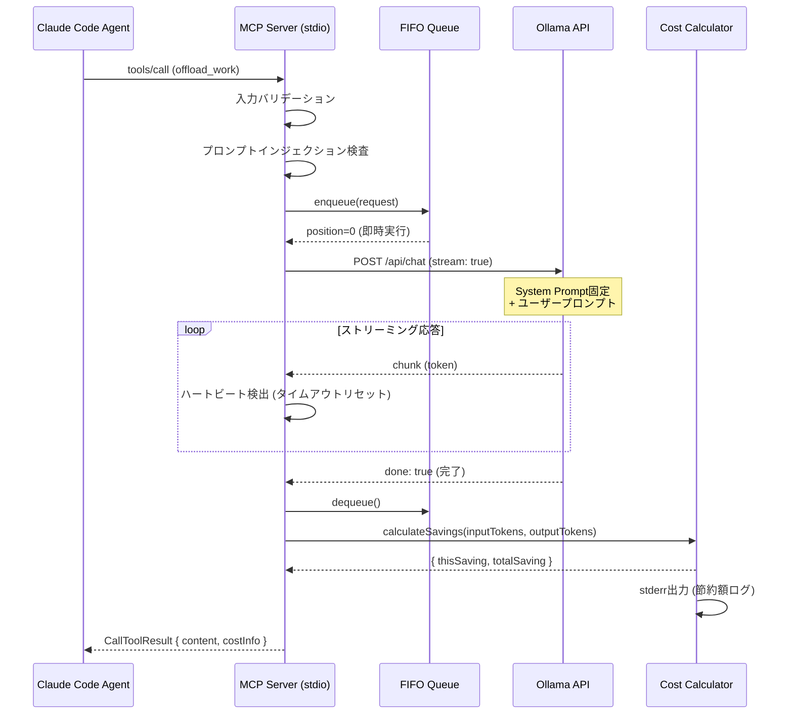
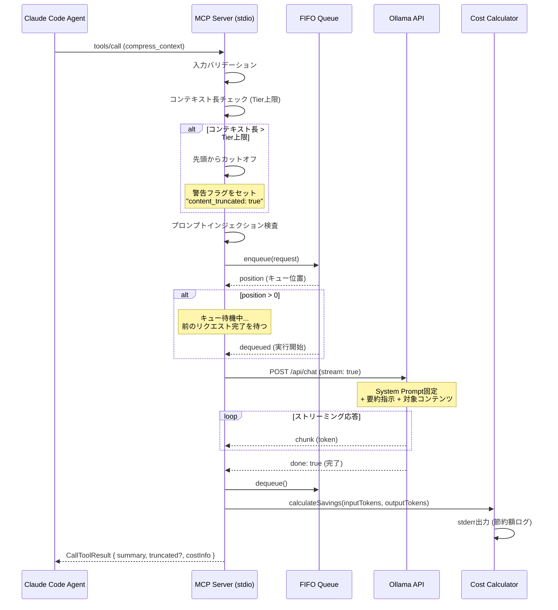
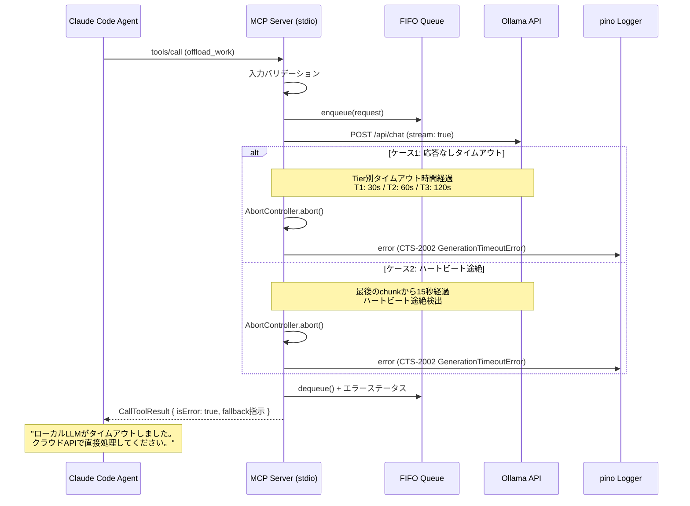
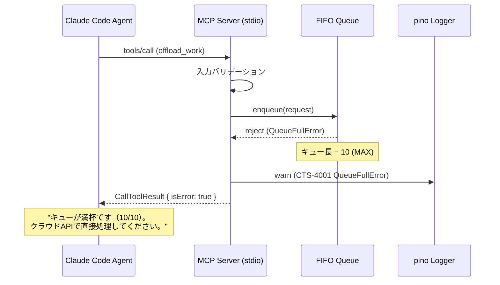
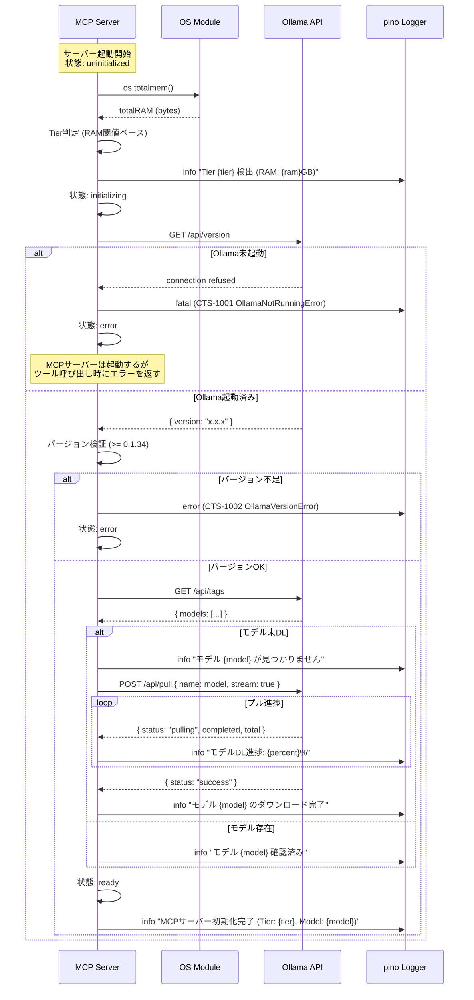
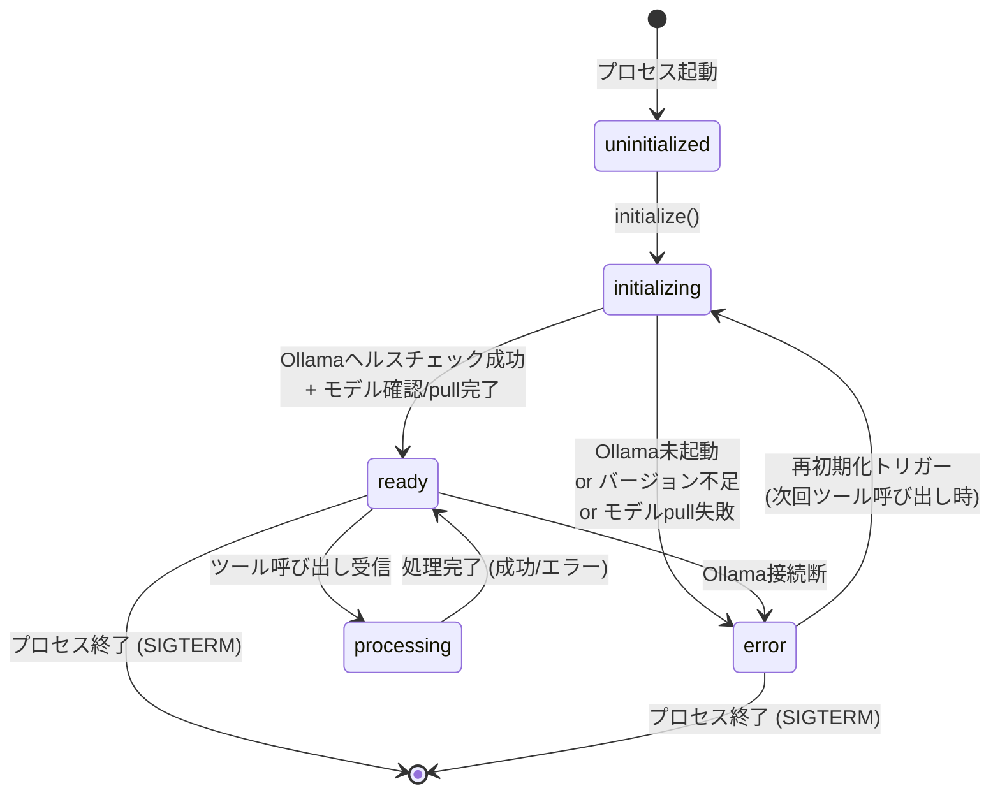
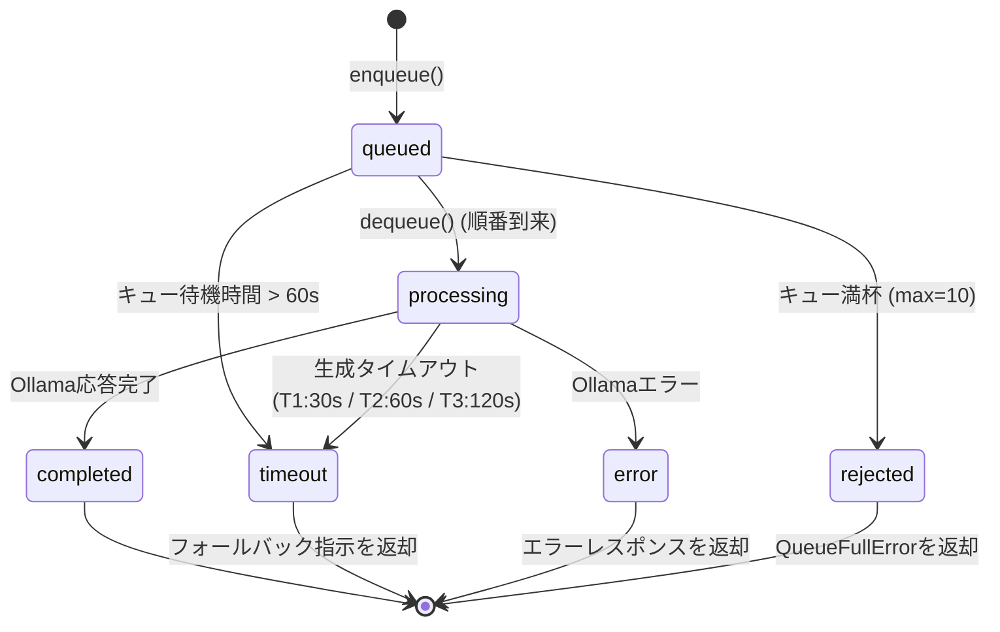
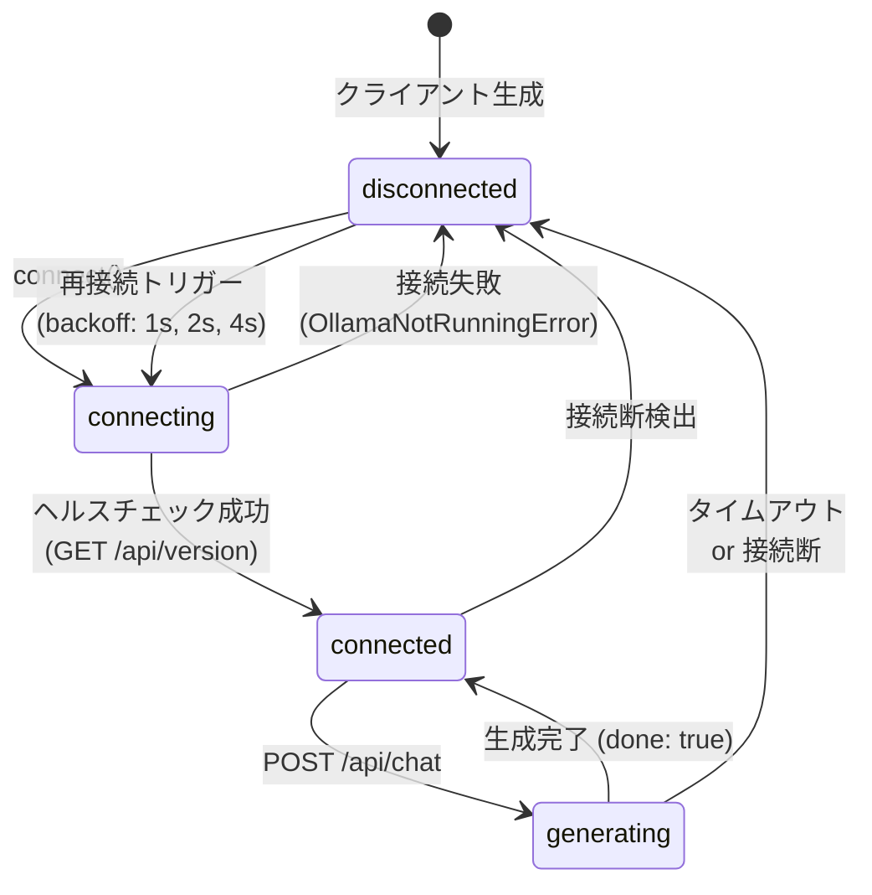
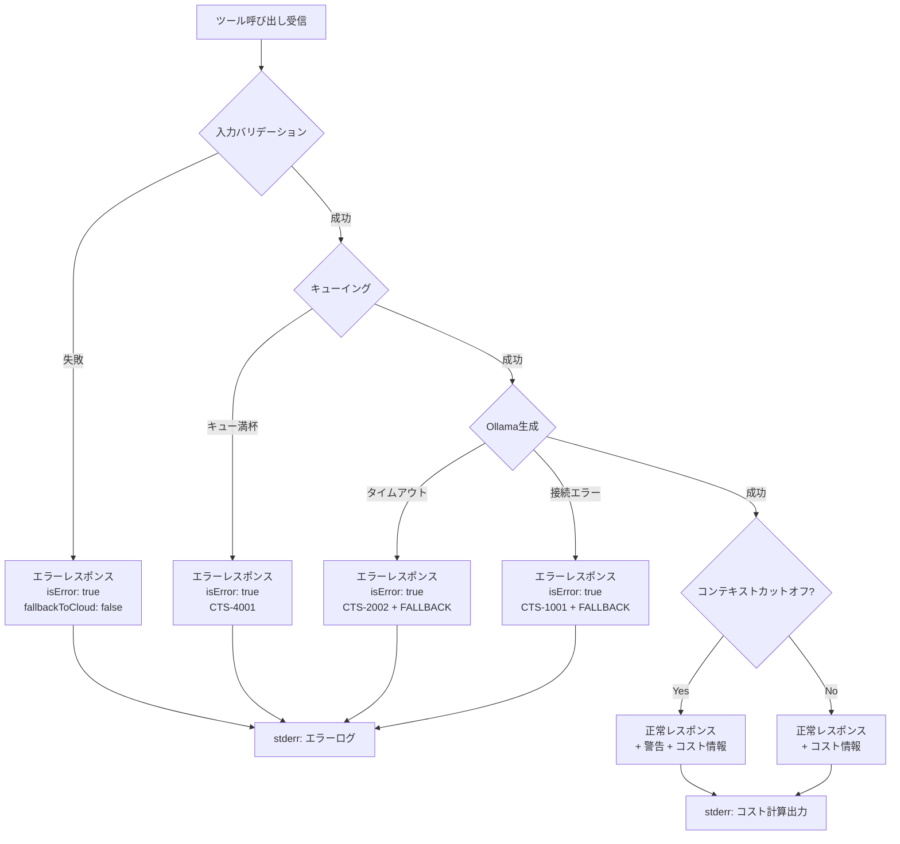
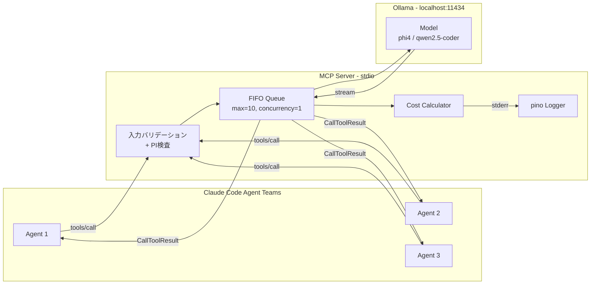

# データフロー・エラー設計書

**プロジェクト:** claude-token-saver-mcp
**バージョン:** v1.0
**作成日:** 2026-02-15
**作成者:** Coder 2 / Logic Agent
**フェーズ:** Phase 2 — 基本設計

---

## 目次

1. [リクエストフロー（シーケンス図）](#1-リクエストフローシーケンス図)
2. [状態遷移図](#2-状態遷移図)
3. [エラークラス階層](#3-エラークラス階層)
4. [エラーコード体系](#4-エラーコード体系)
5. [ロギング設計](#5-ロギング設計)
6. [MCPレスポンス設計](#6-mcpレスポンス設計)

---

## 1. リクエストフロー（シーケンス図）

### 1.1 offload_work 正常フロー

Claude Code Agentが定型タスク（コード生成、テスト作成等）をローカルLLMにオフロードする際の標準フロー。



### 1.2 compress_context 正常フロー

巨大ファイルの要約をローカルLLMで実行し、要約結果のみをクラウドへ返すフロー。



### 1.3 タイムアウト時のフォールバックフロー

ローカルLLMが規定時間内に応答しない場合、クラウドAPI（Claude本体）へのフォールバックを促すエラーを返す。



### 1.4 キュー満杯時のエラーフロー

FIFOキューが上限（10件）に達した場合のリジェクトフロー。



### 1.5 初回起動フロー（Ollamaヘルスチェック + モデルpull）

MCPサーバー起動時にOllamaの状態確認とモデルの存在チェックを行うフロー。



---

## 2. 状態遷移図

### 2.1 サーバー状態

MCPサーバー全体のライフサイクル状態。



**状態定義:**

| 状態 | 説明 | 許可される操作 |
|:---|:---|:---|
| `uninitialized` | プロセス起動直後。初期化前 | initialize()のみ |
| `initializing` | Ollamaヘルスチェック、モデル確認中 | 待機のみ（ツール呼び出しはキューイング） |
| `ready` | 正常稼働中。リクエスト受付可能 | 全ツール呼び出し |
| `processing` | リクエスト処理中（Ollama呼び出し中） | 新規リクエストはキューイング |
| `error` | 異常状態。Ollama接続不可等 | エラーレスポンスを返す。次回呼び出し時に再初期化を試行 |

### 2.2 キュー状態

FIFOキュー内の各リクエストアイテムの状態遷移。



**キュー設定:**

| パラメータ | 値 | 説明 |
|:---|:---|:---|
| `maxQueueSize` | 10 | キューの最大長 |
| `maxConcurrency` | 1 | 同時実行数（シングルキュー） |
| `queueWaitTimeout` | 60,000ms | キュー待機の最大時間 |
| `generationTimeout.tier1` | 30,000ms | Tier 1の生成タイムアウト |
| `generationTimeout.tier2` | 60,000ms | Tier 2の生成タイムアウト |
| `generationTimeout.tier3` | 120,000ms | Tier 3の生成タイムアウト |
| `heartbeatTimeout` | 15,000ms | ストリーミング中のハートビート途絶検出 |

### 2.3 Ollamaクライアント状態

Ollamaとの接続管理の状態遷移。



**再接続ポリシー:**

| パラメータ | 値 | 説明 |
|:---|:---|:---|
| `maxRetries` | 3 | 再接続の最大試行回数 |
| `initialBackoff` | 1,000ms | 初回リトライまでの待機時間 |
| `backoffMultiplier` | 2 | バックオフの倍率（指数バックオフ） |
| `maxBackoff` | 4,000ms | バックオフの上限 |

---

## 3. エラークラス階層

### 3.1 クラス図

```
CTSError (base: CTS-0000)
├── OllamaConnectionError (CTS-1xxx)
│   ├── OllamaNotRunningError (CTS-1001)
│   └── OllamaVersionError (CTS-1002)
├── OllamaTimeoutError (CTS-2xxx)
│   ├── ModelLoadTimeoutError (CTS-2001)
│   └── GenerationTimeoutError (CTS-2002)
├── ModelNotFoundError (CTS-3001)
├── QueueError (CTS-4xxx)
│   ├── QueueFullError (CTS-4001)
│   └── RateLimitError (CTS-4002)
├── InputValidationError (CTS-5xxx)
│   ├── PromptInjectionError (CTS-5001)
│   └── ContextOverflowError (CTS-5002)
└── ConfigError (CTS-6xxx)
    └── InvalidConfigError (CTS-6001)
```

### 3.2 TypeScript実装

```typescript
/**
 * エラーコードの型定義
 */
type CTSErrorCode =
  | 'CTS-1001' | 'CTS-1002'  // OllamaConnection
  | 'CTS-2001' | 'CTS-2002'  // OllamaTimeout
  | 'CTS-3001'                // ModelNotFound
  | 'CTS-4001' | 'CTS-4002'  // Queue
  | 'CTS-5001' | 'CTS-5002'  // InputValidation
  | 'CTS-6001';               // Config

/**
 * 基底エラークラス
 * 全てのCTSエラーはこのクラスを継承する。
 */
export class CTSError extends Error {
  readonly code: CTSErrorCode;
  readonly httpStatus: number;
  readonly retryable: boolean;
  readonly fallbackToCloud: boolean;
  readonly timestamp: string;

  constructor(
    code: CTSErrorCode,
    message: string,
    options: {
      httpStatus?: number;
      retryable?: boolean;
      fallbackToCloud?: boolean;
      cause?: Error;
    } = {},
  ) {
    super(message, { cause: options.cause });
    this.name = 'CTSError';
    this.code = code;
    this.httpStatus = options.httpStatus ?? 500;
    this.retryable = options.retryable ?? false;
    this.fallbackToCloud = options.fallbackToCloud ?? true;
    this.timestamp = new Date().toISOString();
  }

  /**
   * MCPエラーレスポンス用のシリアライズ
   */
  toMCPError(): { code: string; message: string; retryable: boolean } {
    return {
      code: this.code,
      message: this.message,
      retryable: this.retryable,
    };
  }
}

// ─── Ollama接続エラー (CTS-1xxx) ───

export class OllamaConnectionError extends CTSError {
  constructor(code: 'CTS-1001' | 'CTS-1002', message: string, cause?: Error) {
    super(code, message, {
      httpStatus: 503,
      retryable: true,
      fallbackToCloud: true,
      cause,
    });
    this.name = 'OllamaConnectionError';
  }
}

export class OllamaNotRunningError extends OllamaConnectionError {
  constructor(cause?: Error) {
    super(
      'CTS-1001',
      'Ollamaが起動していません。`ollama serve` を実行してください。',
      cause,
    );
    this.name = 'OllamaNotRunningError';
  }
}

export class OllamaVersionError extends OllamaConnectionError {
  constructor(currentVersion: string, requiredVersion: string) {
    super(
      'CTS-1002',
      `Ollamaバージョン ${currentVersion} は非対応です。${requiredVersion} 以上が必要です。`,
    );
    this.name = 'OllamaVersionError';
  }
}

// ─── Ollamaタイムアウトエラー (CTS-2xxx) ───

export class OllamaTimeoutError extends CTSError {
  readonly timeoutMs: number;

  constructor(
    code: 'CTS-2001' | 'CTS-2002',
    message: string,
    timeoutMs: number,
    cause?: Error,
  ) {
    super(code, message, {
      httpStatus: 504,
      retryable: false,
      fallbackToCloud: true,
      cause,
    });
    this.name = 'OllamaTimeoutError';
    this.timeoutMs = timeoutMs;
  }
}

export class ModelLoadTimeoutError extends OllamaTimeoutError {
  constructor(modelName: string, timeoutMs: number) {
    super(
      'CTS-2001',
      `モデル ${modelName} のロードが ${timeoutMs / 1000}秒 でタイムアウトしました。`,
      timeoutMs,
    );
    this.name = 'ModelLoadTimeoutError';
  }
}

export class GenerationTimeoutError extends OllamaTimeoutError {
  constructor(timeoutMs: number, tier: number) {
    super(
      'CTS-2002',
      `Tier ${tier} の生成が ${timeoutMs / 1000}秒 でタイムアウトしました。クラウドAPIで直接処理してください。`,
      timeoutMs,
    );
    this.name = 'GenerationTimeoutError';
  }
}

// ─── モデルエラー (CTS-3xxx) ───

export class ModelNotFoundError extends CTSError {
  constructor(modelName: string) {
    super('CTS-3001', `モデル ${modelName} が見つかりません。自動pullを試行します。`, {
      httpStatus: 404,
      retryable: true,
      fallbackToCloud: false,
    });
    this.name = 'ModelNotFoundError';
  }
}

// ─── キューエラー (CTS-4xxx) ───

export class QueueError extends CTSError {
  constructor(
    code: 'CTS-4001' | 'CTS-4002',
    message: string,
    options?: { retryable?: boolean },
  ) {
    super(code, message, {
      httpStatus: 429,
      retryable: options?.retryable ?? false,
      fallbackToCloud: true,
    });
    this.name = 'QueueError';
  }
}

export class QueueFullError extends QueueError {
  constructor(currentSize: number, maxSize: number) {
    super(
      'CTS-4001',
      `キューが満杯です（${currentSize}/${maxSize}）。クラウドAPIで直接処理してください。`,
      { retryable: false },
    );
    this.name = 'QueueFullError';
  }
}

export class RateLimitError extends QueueError {
  constructor(limitPerMinute: number) {
    super(
      'CTS-4002',
      `レートリミット超過: ${limitPerMinute}リクエスト/分の上限に達しました。`,
      { retryable: true },
    );
    this.name = 'RateLimitError';
  }
}

// ─── 入力バリデーションエラー (CTS-5xxx) ───

export class InputValidationError extends CTSError {
  constructor(code: 'CTS-5001' | 'CTS-5002', message: string) {
    super(code, message, {
      httpStatus: 400,
      retryable: false,
      fallbackToCloud: false,
    });
    this.name = 'InputValidationError';
  }
}

export class PromptInjectionError extends InputValidationError {
  constructor(detectedPattern: string) {
    super(
      'CTS-5001',
      `プロンプトインジェクションの疑いを検出しました: ${detectedPattern}`,
    );
    this.name = 'PromptInjectionError';
  }
}

export class ContextOverflowError extends InputValidationError {
  constructor(inputTokens: number, maxTokens: number, tier: number) {
    super(
      'CTS-5002',
      `入力トークン数 (${inputTokens}) がTier ${tier} の上限 (${maxTokens}) を超えています。`,
    );
    this.name = 'ContextOverflowError';
  }
}

// ─── 設定エラー (CTS-6xxx) ───

export class ConfigError extends CTSError {
  constructor(code: 'CTS-6001', message: string) {
    super(code, message, {
      httpStatus: 500,
      retryable: false,
      fallbackToCloud: false,
    });
    this.name = 'ConfigError';
  }
}

export class InvalidConfigError extends ConfigError {
  constructor(configKey: string, reason: string) {
    super('CTS-6001', `設定エラー: ${configKey} — ${reason}`);
    this.name = 'InvalidConfigError';
  }
}
```

### 3.3 エラー属性の判定基準

| 属性 | 説明 | 判定基準 |
|:---|:---|:---|
| `retryable` | リトライ可能か | 一時的な障害（接続断、レートリミット）→ `true`。恒久的な問題（バリデーション失敗）→ `false` |
| `fallbackToCloud` | クラウドへのフォールバックを推奨するか | ローカルLLMの問題（タイムアウト、キュー満杯）→ `true`。入力側の問題（バリデーション、設定）→ `false` |
| `httpStatus` | 対応するHTTPステータスコード | MCPはHTTPではないが、エラー分類の参考値として使用 |

---

## 4. エラーコード体系

### 4.1 採番ルール

エラーコードは `CTS-XXXX` 形式で、以下のカテゴリ別に採番する。

| カテゴリ | 範囲 | 説明 |
|:---|:---|:---|
| CTS-1xxx | 1001 - 1099 | Ollama接続エラー |
| CTS-2xxx | 2001 - 2099 | Ollamaタイムアウトエラー |
| CTS-3xxx | 3001 - 3099 | モデル関連エラー |
| CTS-4xxx | 4001 - 4099 | キュー・レートリミットエラー |
| CTS-5xxx | 5001 - 5099 | 入力バリデーションエラー |
| CTS-6xxx | 6001 - 6099 | 設定エラー |
| CTS-9xxx | 9001 - 9099 | 予約（将来の拡張用） |

### 4.2 エラーコード一覧

| コード | エラー名 | 説明 | リトライ | フォールバック |
|:---|:---|:---|:---:|:---:|
| CTS-1001 | OllamaNotRunningError | Ollamaプロセスが起動していない | Yes | Yes |
| CTS-1002 | OllamaVersionError | Ollamaバージョンが要件を満たさない (< 0.1.34) | No | Yes |
| CTS-2001 | ModelLoadTimeoutError | モデルのVRAM/RAMへのロードがタイムアウト | No | Yes |
| CTS-2002 | GenerationTimeoutError | テキスト生成がTier別タイムアウトを超過 | No | Yes |
| CTS-3001 | ModelNotFoundError | 指定モデルがOllamaに存在しない | Yes | No |
| CTS-4001 | QueueFullError | FIFOキューが最大長(10)に到達 | No | Yes |
| CTS-4002 | RateLimitError | エージェント別レートリミット超過 | Yes | Yes |
| CTS-5001 | PromptInjectionError | プロンプトインジェクションパターンを検出 | No | No |
| CTS-5002 | ContextOverflowError | 入力トークン数がTier上限を超過 | No | No |
| CTS-6001 | InvalidConfigError | 設定値が不正 | No | No |

### 4.3 MCPエラーレスポンスへのマッピング

MCP SDKの `CallToolResult` におけるエラー表現方式。MCPプロトコルには独自のエラーコード体系がないため、`content` 配列内のテキストでCTSエラーコードを伝達する。

```typescript
/**
 * CTSErrorをMCP CallToolResultに変換する
 */
function ctsErrorToCallToolResult(error: CTSError): CallToolResult {
  const lines: string[] = [
    `[${error.code}] ${error.message}`,
  ];

  if (error.fallbackToCloud) {
    lines.push('');
    lines.push('FALLBACK: このタスクはクラウドAPIで直接処理してください。');
  }

  if (error.retryable) {
    lines.push('RETRY: このエラーは一時的です。しばらく後に再試行できます。');
  }

  return {
    content: [
      {
        type: 'text',
        text: lines.join('\n'),
      },
    ],
    isError: true,
  };
}
```

---

## 5. ロギング設計

### 5.1 ロガー構成

pino構造化ロガーを使用し、JSON形式でstderrへ出力する。MCPサーバーはstdioトランスポートを使用するため、stdoutはMCPプロトコル通信専用、stderrがログとコスト情報の出力先となる。

```typescript
import pino from 'pino';

const logger = pino({
  name: 'claude-token-saver-mcp',
  level: process.env.CTS_LOG_LEVEL ?? 'info',
  transport:
    process.env.NODE_ENV === 'development'
      ? { target: 'pino-pretty', options: { destination: 2 } } // stderr
      : undefined,
  // 本番環境ではJSON形式でstderrへ出力
  // pino はデフォルトで process.stderr に出力する設定が可能
});
```

### 5.2 ログレベル定義

| レベル | 用途 | 出力例 |
|:---|:---|:---|
| `fatal` | サーバー起動不可の致命的エラー | Ollama未起動でサーバー初期化失敗 |
| `error` | リクエスト処理の失敗 | タイムアウト、キュー満杯、プロンプトインジェクション検出 |
| `warn` | 処理は継続するが注意が必要な状況 | コンテキストカットオフ発生、レートリミット接近 |
| `info` | 正常な操作の記録 | サーバー起動/停止、リクエスト処理完了、コスト計算結果 |
| `debug` | 開発時のデバッグ情報 | リクエスト/レスポンス詳細、キュー状態変化 |
| `trace` | 最も詳細なトレース情報 | Ollamaストリーミングchunk、トークンカウント詳細 |

### 5.3 イベント別ログレベルマッピング

| イベント | ログレベル | ログフィールド |
|:---|:---|:---|
| サーバー起動完了 | `info` | `tier`, `model`, `ramGB`, `ollamaVersion` |
| サーバー起動失敗 | `fatal` | `error.code`, `error.message` |
| ツール呼び出し受信 | `info` | `tool`, `requestId`, `inputTokens` |
| キューイング | `debug` | `requestId`, `queuePosition`, `queueSize` |
| Ollama呼び出し開始 | `debug` | `requestId`, `model`, `promptLength` |
| ストリーミングchunk | `trace` | `requestId`, `chunkIndex`, `tokenCount` |
| 処理完了 | `info` | `requestId`, `tool`, `durationMs`, `inputTokens`, `outputTokens` |
| コスト計算 | `info` | `requestId`, `savingUSD`, `totalSavingUSD` |
| タイムアウト | `error` | `requestId`, `error.code`, `timeoutMs`, `tier` |
| キュー満杯 | `warn` | `queueSize`, `maxQueueSize` |
| プロンプトインジェクション検出 | `error` | `requestId`, `detectedPattern` |
| コンテキストカットオフ | `warn` | `requestId`, `inputTokens`, `maxTokens`, `truncatedTokens` |
| Ollama接続断 | `error` | `error.code`, `retryCount` |
| Ollama再接続成功 | `info` | `retryCount`, `backoffMs` |
| モデルpull開始 | `info` | `model` |
| モデルpull完了 | `info` | `model`, `durationMs`, `sizeBytes` |
| モデルpull失敗 | `error` | `model`, `error.message` |
| サーバー停止 (SIGTERM) | `info` | `totalRequests`, `totalSavingUSD` |

### 5.4 ログフォーマット（JSON）

**標準ログエントリ:**

```json
{
  "level": 30,
  "time": 1739612400000,
  "pid": 12345,
  "hostname": "macbook-pro.local",
  "name": "claude-token-saver-mcp",
  "msg": "ツール呼び出し完了",
  "requestId": "req_abc123",
  "tool": "offload_work",
  "durationMs": 4523,
  "inputTokens": 1200,
  "outputTokens": 450,
  "tier": 2,
  "model": "qwen2.5-coder:7b"
}
```

**エラーログエントリ:**

```json
{
  "level": 50,
  "time": 1739612400000,
  "pid": 12345,
  "hostname": "macbook-pro.local",
  "name": "claude-token-saver-mcp",
  "msg": "生成タイムアウト",
  "requestId": "req_def456",
  "err": {
    "type": "GenerationTimeoutError",
    "code": "CTS-2002",
    "message": "Tier 2 の生成が 60秒 でタイムアウトしました。クラウドAPIで直接処理してください。",
    "timeoutMs": 60000,
    "stack": "GenerationTimeoutError: ..."
  },
  "tool": "offload_work",
  "tier": 2,
  "model": "qwen2.5-coder:7b"
}
```

### 5.5 コスト計算のstderr出力フォーマット

コスト情報は通常のpinoログとは別に、人間が読みやすい形式でもstderrに出力する。これはClaude Code Agent TeamsのUIに表示されるためのものである。

```
[CTS Cost] offload_work | 今回: $0.0234 | 累計: $1.4567 | tokens: 1200→450
```

**フォーマット定義:**

```
[CTS Cost] {toolName} | 今回: ${thisSaving} | 累計: ${totalSaving} | tokens: {inputTokens}→{outputTokens}
```

**実装:**

```typescript
interface CostResult {
  inputTokens: number;
  outputTokens: number;
  thisSavingUSD: number;
  totalSavingUSD: number;
}

function emitCostToStderr(toolName: string, cost: CostResult): void {
  const line = `[CTS Cost] ${toolName} | 今回: $${cost.thisSavingUSD.toFixed(4)} | 累計: $${cost.totalSavingUSD.toFixed(4)} | tokens: ${cost.inputTokens}→${cost.outputTokens}`;
  process.stderr.write(line + '\n');
}
```

---

## 6. MCPレスポンス設計

### 6.1 正常レスポンス形式

MCP SDKの `CallToolResult` を使用し、`content` 配列でテキスト結果とコスト情報を返す。

#### offload_work の正常レスポンス

```typescript
const result: CallToolResult = {
  content: [
    {
      type: 'text',
      text: '// 生成されたコード or テキスト結果\nfunction example() {\n  return 42;\n}',
    },
  ],
  // MCP SDK標準にはないカスタムフィールドだが、
  // textの末尾にメタ情報を付与する方式で対応
};
```

**実際のtext出力形式（コスト情報付き）:**

```
function example() {
  return 42;
}

---
[CTS] Saved $0.0234 (total: $1.4567) | Model: qwen2.5-coder:7b | Tokens: 1200→450
```

#### compress_context の正常レスポンス

```typescript
const result: CallToolResult = {
  content: [
    {
      type: 'text',
      text: '要約結果のテキスト...',
    },
  ],
};
```

**コンテキストカットオフが発生した場合:**

```
⚠ 入力がTier 2の上限(12,000 tokens)を超えたため、先頭12,000トークンのみ処理しました。

要約結果のテキスト...

---
[CTS] Saved $0.0456 (total: $1.5023) | Model: qwen2.5-coder:7b | Tokens: 12000→320 | Truncated: true
```

### 6.2 エラーレスポンス形式

`isError: true` を設定し、エラーコードとフォールバック指示を含める。

```typescript
const errorResult: CallToolResult = {
  content: [
    {
      type: 'text',
      text: '[CTS-2002] Tier 2 の生成が 60秒 でタイムアウトしました。クラウドAPIで直接処理してください。\n\nFALLBACK: このタスクはクラウドAPIで直接処理してください。',
    },
  ],
  isError: true,
};
```

### 6.3 レスポンスメタ情報の付与方法

MCPプロトコルの `CallToolResult` は `content` 配列（TextContent/ImageContent/EmbeddedResource）のみを返す仕様であり、カスタムフィールドの追加が制限される。そのため、メタ情報（コスト、処理時間等）は以下の方式で付与する。

**方式: テキスト末尾のメタ行**

```
{生成結果}

---
[CTS] Saved ${thisSaving} (total: ${totalSaving}) | Model: {model} | Tokens: {in}→{out} | Duration: {ms}ms
```

**実装:**

```typescript
function buildToolResponse(
  generatedText: string,
  meta: {
    thisSavingUSD: number;
    totalSavingUSD: number;
    model: string;
    inputTokens: number;
    outputTokens: number;
    durationMs: number;
    truncated?: boolean;
  },
): CallToolResult {
  const metaLine = [
    `Saved $${meta.thisSavingUSD.toFixed(4)} (total: $${meta.totalSavingUSD.toFixed(4)})`,
    `Model: ${meta.model}`,
    `Tokens: ${meta.inputTokens}→${meta.outputTokens}`,
    `Duration: ${meta.durationMs}ms`,
    meta.truncated ? 'Truncated: true' : null,
  ]
    .filter(Boolean)
    .join(' | ');

  const text = `${generatedText}\n\n---\n[CTS] ${metaLine}`;

  return {
    content: [{ type: 'text', text }],
  };
}
```

### 6.4 レスポンスフロー概要図



---

## 付録A: 全体データフロー概要



---

## 付録B: 設定パラメータ一覧

| パラメータ | 環境変数 | デフォルト値 | 説明 |
|:---|:---|:---|:---|
| ログレベル | `CTS_LOG_LEVEL` | `info` | pinoログレベル |
| Ollamaホスト | `OLLAMA_HOST` | `http://127.0.0.1:11434` | Ollama APIエンドポイント |
| 最大キューサイズ | `CTS_MAX_QUEUE_SIZE` | `10` | FIFOキューの最大長 |
| キュー待機タイムアウト | `CTS_QUEUE_WAIT_TIMEOUT` | `60000` | キュー待機の最大時間(ms) |
| Tier 1タイムアウト | `CTS_TIMEOUT_TIER1` | `30000` | Tier 1生成タイムアウト(ms) |
| Tier 2タイムアウト | `CTS_TIMEOUT_TIER2` | `60000` | Tier 2生成タイムアウト(ms) |
| Tier 3タイムアウト | `CTS_TIMEOUT_TIER3` | `120000` | Tier 3生成タイムアウト(ms) |
| ハートビートタイムアウト | `CTS_HEARTBEAT_TIMEOUT` | `15000` | ストリーミング中の無応答検出(ms) |
| 再接続最大リトライ | `CTS_MAX_RETRIES` | `3` | Ollama再接続の最大試行回数 |
| Claude Input価格 | `CTS_CLAUDE_INPUT_PRICE` | `0.003` | Claude Sonnet入力 $/1Kトークン |
| Claude Output価格 | `CTS_CLAUDE_OUTPUT_PRICE` | `0.015` | Claude Sonnet出力 $/1Kトークン |
| Ollama必須バージョン | — | `0.1.34` | セキュリティ要件(CVE対応)の最低バージョン |

---

## 7. v0.3.0 追加データフロー

### 7.1 batch_offload データフロー

```
1. クライアント → batch_offload(tasks, sequential?)
2. Zod バリデーション (1-10タスク)
3. Ollama 健全性チェック (不健全 → FALLBACK_TO_CLOUD)
4. [parallel] 全タスクを同時にキュー投入
   └→ 各タスク: 入力バリデーション → PI検知 → モデル解決 → enqueue
   └→ キュー concurrency=1 で順次処理
5. [sequential] 1件ずつ処理
   └→ タスクN の結果を タスクN+1 の context として渡す
6. 結果集約: 各タスクの成功/失敗/コスト → 合計表示
```

### 7.2 分散実行データフロー (OllamaLoadBalancer)

```
1. chat(request) 呼び出し
2. selectNode(request) — 戦略に基づきノード選択
   ├→ round-robin: 循環インデックスで次ノード
   ├→ least-connections: activeConnections/weight 最小ノード
   └→ model-affinity: request.model がloadedModelsに含まれるノード優先
3. 選択ノードの client.chat(request) 実行
4. 失敗時: 残りの健全ノードを順次試行 (フェイルオーバー)
5. 全ノード失敗: OllamaNotRunningError throw

ヘルスチェック (定期):
1. 全ノードの client.healthCheck() 実行
2. 健全ノード: client.listRunning() でloadedModels更新
3. 不健全ノード: healthy=false にマーク
```

### 7.3 メトリクス収集フロー

```
1. ツール実行完了時:
   └→ metricsCollector.recordRequest(toolName, durationMs, success, errorCode?)
   └→ metricsCollector.recordTokens(inputTokens, outputTokens)
   └→ metricsCollector.recordSavings(savingsUsd)
2. ヘルスチェック時:
   └→ metricsCollector.updateOllamaHealth(healthy)
   └→ metricsCollector.updateQueueLength(queue.getStatus().currentLength)
3. get_metrics ツール呼び出し:
   └→ format=json: metricsCollector.toJSON()
   └→ format=prometheus: metricsCollector.toPrometheusText()
```

### 7.4 auto_setup データフロー

```
1. クライアント → auto_setup(category?, prefer_quality?, skip_pull?, skip_preload?)
2. Ollama 健全性チェック (不健全→再チェック→CTS-1001)
3. listModelsFull() + listRunning() でモデル状態取得
4. recommendModels() → #1推奨モデル選択
5. [未インストール & !skip_pull] → pullModel(modelId)
6. [未ロード & !skip_preload] → chat(empty, keep_alive) でプリロード
7. 結果: System info + Selected model + Steps + Usage
```

### 7.5 永続化データフロー

```
起動時: PersistenceManager.loadAll()
  └→ execution-history.json → ExecutionTracker.loadFromFile()
  └→ benchmark-data.json → BenchmarkStore.loadFromFile()

運用中: 5分間隔 auto-save
  └→ ExecutionTracker.saveToFile() → execution-history.json
  └→ BenchmarkStore.saveToFile() → benchmark-data.json

終了時: PersistenceManager.saveAll()
  └→ 最終データを書き込み
```
