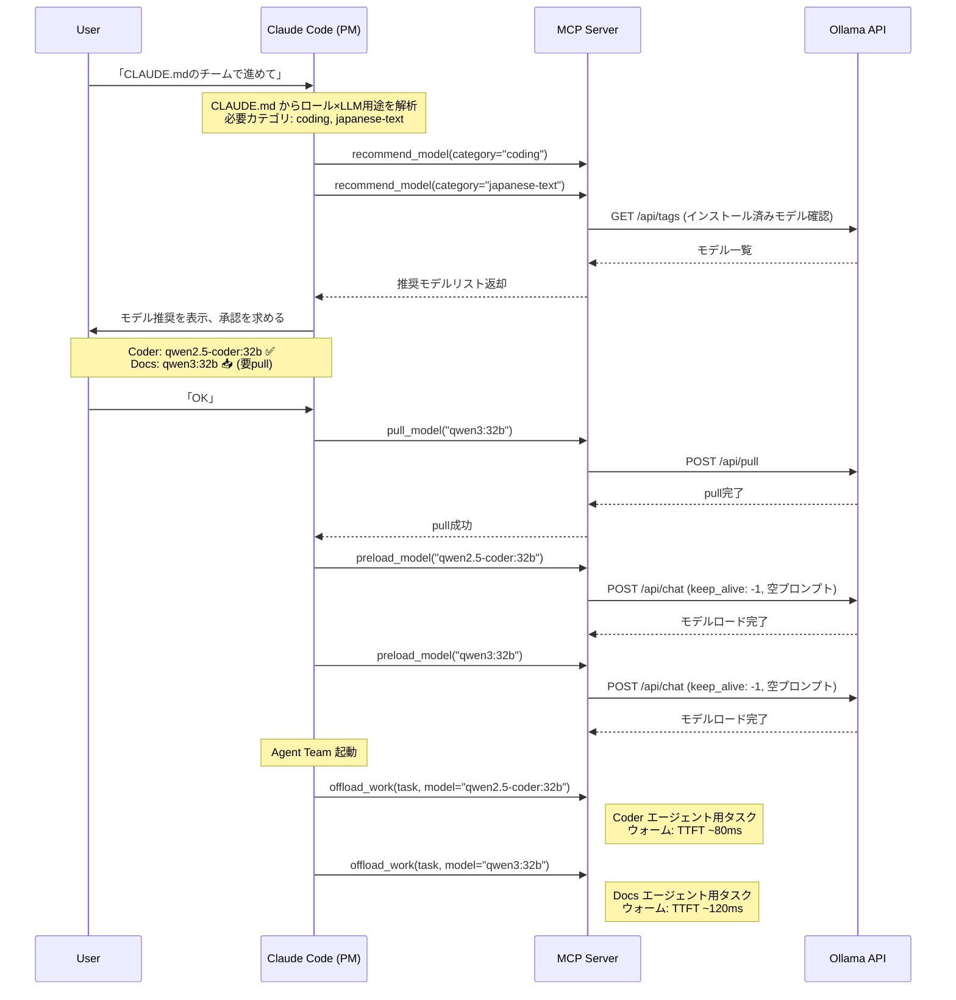

# 動的モデルセレクター設計書

**作成日:** 2026-02-19
**最終更新:** 2026-02-19 (DS-008 セッション固定方式採用)
**ステータス:** Phase 2 設計（評議会承認済み）
**入力:** researcher-coding調査, researcher-japanese調査, governance調査, architect技術調査, UX researcher調査

---

## 1. 概要

### 1.1 目的

マルチエージェントチーム起動時に、CLAUDE.mdに定義されたロール×LLM用途を読み取り、
実行環境のPCスペック（RAM/VRAM）に応じた最適なローカルLLMを**推奨**し、
ユーザー承認のもと**セッション全体で固定使用**する。

### 1.2 方式: セッション固定方式 (DS-008)

| 項目 | 決定 |
|:---|:---|
| モデル選択タイミング | Agent Team起動時（1回のみ） |
| モデル切替 | セッション中は固定（切替しない） |
| 選択の主体 | Claude Code (PM) がCLAUDE.mdを解析し推奨、ユーザーが承認 |
| 技術的根拠 | Ollamaモデル切替コスト18〜35秒が致命的 (architect調査) |

### 1.3 ガバナンス制約（DS-008）

governance調査に基づく設計原則:

1. **「推奨」に留め「自動選択」は避ける** — ユーザーの最終判断を必ず介在
2. **推奨時にライセンス情報を表示** — コンプライアンス確保
3. **Apache 2.0 / MIT モデルをデフォルト推奨** — ライセンスリスク最小化
4. **先行技術差別化** — MCPツールとしての推奨UIは差別化ポイント

### 1.4 CLAUDE.md連携

CLAUDE.mdのロールテーブルに `LLM用途` 列を追加し、Claude Codeが起動時に解析する。

```markdown
## チーム構成と役割定義

| 役割 | 担当 | LLM用途 | 備考 |
|:---|:---|:---|:---|
| PM / Coder 1 | Claude Code | Cloud API | 全体統括 |
| Coder 2 | Local LLM | coding | コード生成・最適化 |
| Tester | Local LLM | coding | テストコード作成 |
| Docs | Local LLM | japanese-text | 日本語ドキュメント |
| Researcher | Claude Code | Cloud API | 調査（ネット必要） |
```

Claude Codeは `LLM用途` 列の値を `recommend_model` ツールの `category` パラメータとして使用する。

---

## 2. 用途カテゴリ定義

| カテゴリ ID | 表示名 | 説明 | 代表的タスク |
|:---|:---|:---|:---|
| `coding` | コーディング | コード生成・リファクタ・デバッグ | 関数生成、バグ修正、テスト作成 |
| `coding-agent` | コーディングエージェント | 複雑なSWEタスク、マルチファイル変更 | PRレビュー、大規模リファクタ |
| `japanese-text` | 日本語テキスト | 日本語の文章生成・編集・QA | ドキュメント作成、メール起草、QA |
| `japanese-coding` | 日本語コーディング | 日本語コメント付きコード、日本語指示 | 日本語README、JSDoc日本語 |
| `translation` | 翻訳 | 日英・英日翻訳 | i18n翻訳、ドキュメント翻訳 |
| `summarization` | 要約 | 大量テキストの圧縮・要約 | ログ要約、PR要約、コードレビュー要約 |
| `general` | 汎用 | 上記に当てはまらないタスク | 質問応答、分析、説明 |

---

## 3. モデルレジストリ

### 3.1 推奨モデルテーブル

各用途×Tier（RAM容量）ごとに推奨モデルを定義する。

```typescript
interface ModelRecommendation {
  modelId: string;         // Ollama モデルID (e.g. "qwen2.5-coder:7b")
  displayName: string;     // 表示名
  category: TaskCategory;  // 用途カテゴリ
  tier: TierLevel;         // 対応Tier (1/2/3)
  minRamGB: number;        // 最低RAM (GB)
  parameterSize: string;   // パラメータ数 (e.g. "7B", "32B")
  quantization: string;    // 推奨量子化 (e.g. "Q4_K_M")
  vramRequired: number;    // 推定VRAM (GB)
  license: LicenseType;    // ライセンス種別
  licenseNote?: string;    // ライセンス補足
  benchmarks: {            // ベンチマークスコア
    humanEval?: number;
    sweBench?: number;
    japaneseMTBench?: number;
  };
  ollamaAvailable: boolean;  // ollama pull で取得可能か
  priority: number;          // 同一カテゴリ・Tier内の優先度 (1が最高)
}

type TaskCategory =
  | 'coding'
  | 'coding-agent'
  | 'japanese-text'
  | 'japanese-coding'
  | 'translation'
  | 'summarization'
  | 'general';

type LicenseType =
  | 'Apache-2.0'
  | 'MIT'
  | 'NVIDIA-Open'
  | 'Meta-Community'
  | 'PLaMo-Community'
  | 'Other';
```

### 3.2 コーディング用推奨マトリックス

| Tier | RAM | 第1推奨 | 第2推奨 | 第3推奨 |
|:---:|:---:|:---|:---|:---|
| 1 | < 16GB | qwen2.5-coder:3b (Q4) | qwen2.5-coder:1.5b | - |
| 2 | 16-48GB | qwen2.5-coder:7b (Q4) | deepseek-coder-v2:16b (Q4) | qwen2.5-coder:14b (Q4) |
| 3 | > 48GB | qwen2.5-coder:32b (Q4) | qwen3-coder:30b (Q4) | devstral:24b (Q4) |

### 3.3 日本語テキスト用推奨マトリックス

| Tier | RAM | 第1推奨 | 第2推奨 | 第3推奨 |
|:---:|:---:|:---|:---|:---|
| 1 | < 16GB | qwen3:8b (Q4) | gemma3:4b | - |
| 2 | 16-48GB | qwen3:14b (Q4) | nemotron-3-nano (Q4) | gemma3:12b |
| 3 | > 48GB | qwen3:32b (Q4) | qwen3:14b (Q8) | gemma3:27b |

### 3.4 コーディングエージェント用推奨マトリックス

| Tier | RAM | 第1推奨 | 第2推奨 | 第3推奨 |
|:---:|:---:|:---|:---|:---|
| 1 | < 16GB | qwen2.5-coder:7b (Q4) | - | - |
| 2 | 16-48GB | qwen3-coder:30b (Q4) | devstral:24b (Q4) | qwen2.5-coder:14b (Q4) |
| 3 | > 48GB | qwen2.5-coder:32b (Q4) | qwen3-coder:30b (Q8) | devstral:24b (Q8) |

### 3.5 翻訳用推奨マトリックス

| Tier | RAM | 第1推奨 | 第2推奨 |
|:---:|:---:|:---|:---|
| 1 | < 16GB | qwen3:8b (Q4) | gemma3:4b |
| 2 | 16-48GB | qwen3:14b (Q4) | nemotron-3-nano |
| 3 | > 48GB | qwen3:32b (Q4) | qwen3:14b (Q8) |

### 3.6 要約用推奨マトリックス

| Tier | RAM | 第1推奨 | 第2推奨 |
|:---:|:---:|:---|:---|
| 1 | < 16GB | qwen3:8b (Q4) | qwen2.5-coder:3b (Q4) |
| 2 | 16-48GB | qwen3:14b (Q4) | qwen2.5-coder:7b (Q4) |
| 3 | > 48GB | qwen3:32b (Q4) | qwen2.5-coder:32b (Q4) |

### 3.7 汎用（コーディング+日本語兼用 / RAM不足時の統合モデル）

| Tier | RAM | 推奨 |
|:---:|:---:|:---|
| 1 | < 16GB | qwen3:8b (Q4) |
| 2 | 16-48GB | qwen3:14b (Q4) |
| 3 | > 48GB | qwen3:32b (Q4) |

> **Note:** RAM不足で2モデル同時ロードが不可能な場合、`recommend_model` は汎用テーブルから「1モデルで兼用」を推奨する（セクション5.4参照）。

---

## 4. MCPツール設計

### 4.1 新規ツール: `recommend_model`

Ollamaのインストール済みモデル一覧とPCスペックを照合し、用途に最適なモデルを推奨する。

```typescript
// inputSchema
{
  type: 'object',
  properties: {
    category: {
      type: 'string',
      enum: ['coding', 'coding-agent', 'japanese-text',
             'japanese-coding', 'translation', 'summarization', 'general'],
      description: 'タスクの用途カテゴリ',
    },
    prefer_quality: {
      type: 'boolean',
      description: '品質優先 (true) か速度優先 (false) か (デフォルト: false)',
    },
  },
  required: ['category'],
}
```

```typescript
// レスポンス例
{
  content: [{
    type: 'text',
    text: `## Model Recommendation

**Category:** coding
**System:** Tier 3 (Ultra) — 64GB RAM, Apple M2 Max

### Recommended Models (available locally):
1. ✅ **qwen2.5-coder:32b** (Q4_K_M) — HumanEval: 92.7% | License: Apache 2.0
2. ✅ **qwen2.5-coder:7b** (Q4_K_M) — HumanEval: 88.4% | License: Apache 2.0

### Additional options (requires pull):
3. 📥 qwen3-coder:30b — SWE-Bench: 70.6% | License: Apache 2.0
4. 📥 devstral:24b — SWE-Bench: 68.0% | License: Apache 2.0

Use offload_work with model parameter to select.`
  }]
}
```

### 4.2 既存ツール拡張: `offload_work` に `model` パラメータ追加

```typescript
// inputSchema 変更（model パラメータ追加）
{
  type: 'object',
  properties: {
    task: { type: 'string', description: 'タスク内容' },
    context: { type: 'string', description: 'コンテキスト' },
    language: { type: 'string', description: 'プログラミング言語' },
    output_format: { type: 'string', enum: ['code', 'diff', 'explanation', 'raw'] },
    model: {
      type: 'string',
      description: 'Ollamaモデル名 (省略時はTier自動検出で選択)',
    },
    category: {
      type: 'string',
      enum: ['coding', 'coding-agent', 'japanese-text',
             'japanese-coding', 'translation', 'summarization', 'general'],
      description: '用途カテゴリ (省略時はgeneral。modelが未指定の場合、カテゴリに応じた最適モデルを自動推奨)',
    },
  },
  required: ['task'],
}
```

### 4.3 既存ツール拡張: `compress_context` に `model` パラメータ追加

```typescript
// inputSchema 変更（model パラメータ追加）
{
  type: 'object',
  properties: {
    content: { type: 'string', description: 'コンテンツ' },
    focus: { type: 'string', description: 'フォーカス' },
    max_length: { type: 'number', description: '最大長' },
    model: {
      type: 'string',
      description: 'Ollamaモデル名 (省略時はTier自動検出)',
    },
  },
  required: ['content'],
}
```

### 4.4 新規ツール: `preload_model`

セッション開始時にモデルをVRAMに常駐させ、リクエスト時のコールドスタートを排除する。

```typescript
// inputSchema
{
  type: 'object',
  properties: {
    model: {
      type: 'string',
      description: 'プリロードするモデル名 (e.g. "qwen2.5-coder:32b")',
    },
    keep_alive: {
      type: 'string',
      description: 'モデル常駐期間 ("-1"=永続, "30m"=30分) デフォルト: "-1"',
    },
  },
  required: ['model'],
}
```

```typescript
// レスポンス例
{
  content: [{
    type: 'text',
    text: `Model preloaded successfully.

**Model:** qwen2.5-coder:32b
**VRAM Usage:** ~18.5 GB
**Keep Alive:** permanent (until offload or server restart)
**Status:** ready for inference

Currently loaded models: 1/2 (max for this system)`
  }]
}
```

**実装:**
- Ollama `/api/chat` に空リクエスト + `keep_alive: -1` を送信してモデルをロード
- `/api/ps` でロード確認
- VRAM使用量をレスポンスに含める

### 4.5 新規ツール: `list_loaded_models`

現在VRAMにロードされているモデルの一覧を返す。

```typescript
// inputSchema
{
  type: 'object',
  properties: {},
  required: [],
}
```

```typescript
// レスポンス例
{
  content: [{
    type: 'text',
    text: `## Loaded Models

| # | Model | VRAM | Since | Keep Alive |
|:---:|:---|:---:|:---|:---:|
| 1 | qwen2.5-coder:32b | 18.5 GB | 3 min ago | permanent |
| 2 | qwen3:14b | 8.2 GB | 1 min ago | permanent |

**VRAM Total:** 26.7 GB / 48 GB available
**Slots:** 2/2 used`
  }]
}
```

---

## 5. モデル検出・推奨フロー

### 5.1 シーケンス図（セッション固定方式）



### 5.2 モデル検出ロジック

```typescript
async function detectAvailableModels(client: OllamaClient): Promise<{
  installed: string[];   // インストール済みモデル
  running: string[];     // 現在ロード中のモデル
}> {
  const [tags, ps] = await Promise.all([
    client.listModels(),   // GET /api/tags
    client.listRunning(),  // GET /api/ps
  ]);
  return {
    installed: tags.models.map(m => m.name),
    running: ps.models.map(m => m.name),
  };
}
```

### 5.3 推奨アルゴリズム

```
入力: category, preferQuality, tier, installedModels

1. 推奨テーブルから (category, tier) に一致するモデルリストを取得
2. preferQuality = true の場合、大きいモデルを優先ソート
3. preferQuality = false の場合、小さいモデル（高速）を優先ソート
4. 各モデルについて:
   a. installedModels に含まれる → ✅ マーク
   b. 含まれない → 📥 マーク (pullが必要)
5. ✅ モデルを先頭、📥 モデルを後尾にソート
6. ライセンス情報を付与
7. 上位4件を返却
```

## 5.4 VRAM 同時ロード制約

Ollamaは複数モデルの同時ロードをサポートするが、VRAM容量に依存する。
環境変数 `OLLAMA_MAX_LOADED_MODELS` で同時ロード数を制御可能。

| PC RAM | 推定VRAM (Apple Silicon統合) | 同時ロード可能数 | 推奨戦略 |
|:---|:---:|:---:|:---|
| < 16 GB | ~10 GB | **1** | 兼用モデル1つ（coding兼summarization） |
| 16-32 GB | ~12-24 GB | **1-2** | coding + 汎用（7B × 2） |
| 32-48 GB | ~24-36 GB | **2** | coding + japanese（7B + 14B） |
| 48-64 GB | ~36-48 GB | **2-3** | coding(32B) + japanese(14B) |
| 64-128 GB | ~48-96 GB | **3-4** | coding(32B) + japanese(32B) + 汎用 |

**フォールバック戦略:**
- 同時ロード可能数 = 1 の場合: `general` カテゴリで最適な兼用モデルを1つ推奨
- 同時ロード可能数 ≥ 2 の場合: CLAUDE.md の `LLM用途` から重複を排除し、用途別に推奨

---

## 6. マルチエージェント対応 UX フロー

### 6.1 Agent Team 起動シーケンス（セッション固定方式）

```
[Phase A: CLAUDE.md 解析]

1. ユーザー: 「チームを作ってこのタスクを進めて」
2. PM (Claude Code): CLAUDE.md を読み込み、ロールテーブルの LLM用途 列を解析
   → 必要カテゴリを抽出: ["coding", "japanese-text"]
   → 重複排除 + VRAM制約チェック

[Phase B: モデル推奨]

3. PM → MCP: recommend_model(category="coding")
4. PM → MCP: recommend_model(category="japanese-text")
5. PM → ユーザーに推奨表示:
   「CLAUDE.mdのロール定義に基づき、以下のモデル割り当てを推奨します:

    | ロール | 用途 | 推奨モデル | 状態 | ライセンス |
    |:---|:---|:---|:---|:---|
    | Coder 2 | coding | qwen2.5-coder:32b | ✅ installed | Apache 2.0 |
    | Docs | japanese-text | qwen3:14b | 📥 要pull | Apache 2.0 |

    VRAM使用見込み: 26.7 GB / 48 GB
    承認しますか？」

[Phase C: モデル準備]

6. ユーザー承認
7. PM → MCP: pull_model(model="qwen3:14b")        # 未インストール分のみ
8. PM → MCP: preload_model(model="qwen2.5-coder:32b")  # VRAM常駐
9. PM → MCP: preload_model(model="qwen3:14b")          # VRAM常駐
10. PM → MCP: list_loaded_models()                      # ロード確認

[Phase D: エージェント起動]

11. PM: Agent Teamを起動
    → Coder 2 には model="qwen2.5-coder:32b" を指示
    → Docs には model="qwen3:14b" を指示
12. セッション中はモデル固定（切替なし）
```

### 6.1.1 パターン2: ユーザー直接指定

CLAUDE.mdにロール定義がない場合や、ユーザーが特定のモデルを使いたい場合:

```
1. ユーザー: 「qwen2.5-coder:7b でコーディングタスクを進めて」
2. PM → MCP: preload_model(model="qwen2.5-coder:7b")
3. PM: 全エージェントに model="qwen2.5-coder:7b" を指示
```

### 6.2 エージェント別モデル指定

```typescript
// Coder エージェントの呼び出し
offload_work({
  task: "Implement the authentication middleware",
  language: "typescript",
  model: "qwen2.5-coder:32b",
  category: "coding",
})

// ドキュメントエージェントの呼び出し
offload_work({
  task: "README.mdの使い方セクションを日本語で書いて",
  model: "qwen3:14b",
  category: "japanese-text",
})

// 翻訳エージェントの呼び出し
offload_work({
  task: "Translate this error message to Japanese",
  context: "Authentication failed: invalid token",
  model: "qwen3:14b",
  category: "translation",
})
```

---

## 7. 自動pullフロー

### 7.1 新規ツール: `pull_model`

推奨されたモデルがインストールされていない場合に、ユーザー承認のもとpullする。

```typescript
// inputSchema
{
  type: 'object',
  properties: {
    model: {
      type: 'string',
      description: 'pull するモデル名 (e.g. "qwen3:14b")',
    },
  },
  required: ['model'],
}
```

### 7.2 pullプログレスレスポンス

Ollama の `/api/pull` はストリーミングで進捗を返すため、
MCPレスポンスでは完了後のステータスのみ返す（stdio transport制約）。

```typescript
// レスポンス例
{
  content: [{
    type: 'text',
    text: 'Model qwen3:14b pulled successfully (8.2 GB, 45s).'
  }]
}
```

---

## 8. 設定拡張

### 8.1 config.json 拡張

```json
{
  "modelSelector": {
    "enabled": true,
    "preferQuality": false,
    "preloadKeepAlive": "-1",
    "maxSimultaneousModels": "auto",
    "customRecommendations": {
      "coding": {
        "2": ["my-custom-coder:7b", "qwen2.5-coder:7b"]
      }
    },
    "blockedModels": ["codestral"],
    "licenseFilter": ["Apache-2.0", "MIT", "NVIDIA-Open"]
  }
}
```

| キー | 型 | デフォルト | 説明 |
|:---|:---|:---|:---|
| `enabled` | boolean | `true` | モデルセレクター機能の有効/無効 |
| `preferQuality` | boolean | `false` | 品質優先 (true) / 速度優先 (false) |
| `preloadKeepAlive` | string | `"-1"` | preload_model時のkeep_alive値。`"-1"`=永続、`"30m"`=30分 |
| `maxSimultaneousModels` | string\|number | `"auto"` | 同時ロード最大数。`"auto"`=RAM自動判定 |
| `customRecommendations` | object | `{}` | カテゴリ×Tierのカスタム推奨 |
| `blockedModels` | string[] | `["codestral"]` | 推奨から除外するモデル (MNPL等) |
| `licenseFilter` | string[] | `["Apache-2.0","MIT","NVIDIA-Open"]` | 推奨に含めるライセンス |

### 8.2 環境変数

| 変数 | デフォルト | 説明 |
|:---|:---|:---|
| `MODEL_SELECTOR_ENABLED` | `true` | モデルセレクター機能の有効/無効 |
| `MODEL_PREFER_QUALITY` | `false` | 品質優先 (true) / 速度優先 (false) |
| `PRELOAD_KEEP_ALIVE` | `"-1"` | preload_model時のkeep_alive値 |
| `MAX_SIMULTANEOUS_MODELS` | `auto` | 同時ロード最大数 |

---

## 9. 実装フェーズ

### Phase 1: モデル推奨基盤（MVP）
- [ ] Ollama `/api/tags` クライアント実装（インストール済みモデル一覧取得）
- [ ] Ollama `/api/ps` クライアント実装（ロード中モデル一覧取得）
- [ ] 推奨モデルテーブル（静的JSON: カテゴリ×Tier→モデルリスト）
- [ ] VRAM同時ロード上限の自動判定ロジック
- [ ] `recommend_model` ツール実装
- [ ] テスト: recommend_model ユニットテスト + 統合テスト

### Phase 2: セッション固定 & プリロード
- [ ] `preload_model` ツール実装（keep_alive パラメータ対応）
- [ ] `list_loaded_models` ツール実装
- [ ] `offload_work` / `compress_context` に `model` パラメータ追加
- [ ] モデル指定時のOllamaリクエスト切替ロジック
- [ ] VRAM同時ロード制約の実行時チェック
- [ ] テスト: preload/list/model切替のユニットテスト + 統合テスト

### Phase 3: 自動pull & CLAUDE.md連携
- [ ] `pull_model` ツール実装
- [ ] Ollama `/api/pull` ストリーミング対応
- [ ] pull完了後のモデル可用性再チェック
- [ ] CLAUDE.md `LLM用途` 列パーサー（Claude Code側参考実装）
- [ ] テスト: pull_model ユニットテスト

### Phase 4: 高度な推奨
- [ ] ベンチマークデータベース（定期更新機構）
- [ ] 実行履歴に基づく推奨精度向上
- [ ] カスタム推奨テーブルの設定対応
- [ ] 量子化バリアント自動選択
- [ ] ブロックリスト・ライセンスフィルタの設定UI

---

## 10. ガバナンス記録

### DS-008: セッション固定方式を採用

**根拠:**
- Ollamaモデル切替コスト 18-35秒が致命的（リクエストごと切替は実用不可）
- MCP stdio transport制約で起動時の対話的質問が不可能
- ユーザー承認フローをセッション開始時に一括化することでUX向上
- `keep_alive: -1` によりセッション中のウォームスタート（80-380ms TTFT）が保証される

### 調査結果サマリ

| 調査 | 担当 | 結果 |
|:---|:---|:---|
| コーディングLLM動向 | researcher-coding | Qwen2.5-Coder-32B最優先、Qwen3-Coder次点 |
| 日本語LLM動向 | researcher-japanese | Qwen3が日本語最強、Nemotron 3 Nano注目 |
| 特許・ライセンス | governance | GO（推奨UIに留めれば低リスク） |
| モデル切替コスト | architect | 7B→32B: 18-35秒、ウォーム時: 80-380ms |

### 特許リスク対応

- 「推奨」機能であり「自動ルーティング」ではない点を明確化
- ユーザー承認フローを必須化
- 先行技術（LM Studio, GPT4All, llmfit）との差別化を文書化

### ライセンスリスク対応

- デフォルト推奨はApache 2.0 / MIT モデルのみ
- Codestral (MNPL) はブロックリストに初期設定
- Meta Community License モデルは注意表示付き
